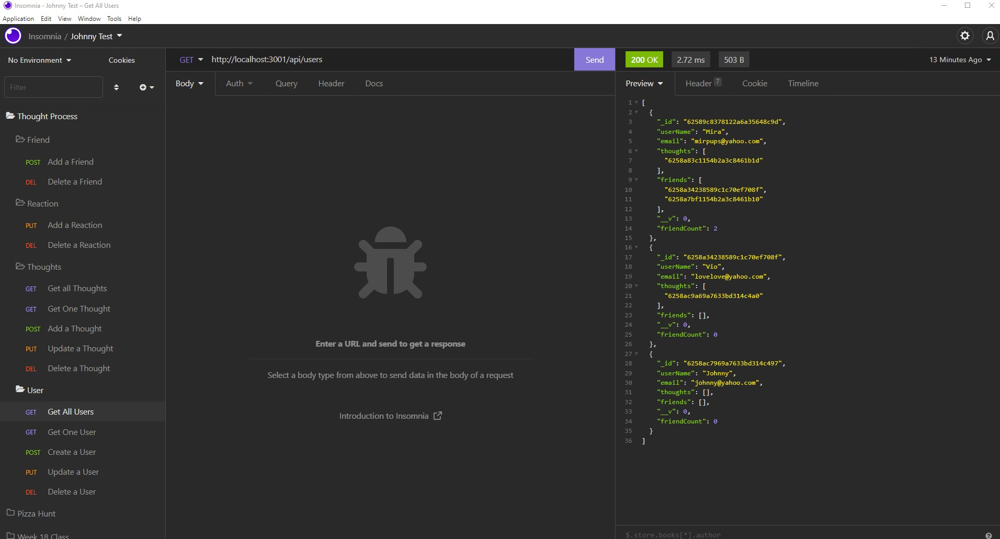

# Thought-Process

## Table of Contents

- [Usage](#usage)
- [Questions](#questions)

## Description

This is the back end for a social media platform knowon as Thought-Process. In here Users can create posts called thoughts and then other users can comment on these thoughts. We aslo have friends list functionality. Here is a <a href="https://drive.google.com/file/d/1kUoUg9vKsp117-apikklWmsNFd2ZW9ij/view" target="_blank">link</a> if you want to see the program in action.

## Usage

To use this program simply download the files above and then navigate to your terminal. Once there type `npm i` to get your packages installed and finally type in `npm start` to fire it up. After that you are good to go and can test these routes in insomnia.

## Questions

<a href="https://github.com/JohnKnee3">JohnKnee3's GitHub</a>

If you want to contact me please send me an email at john.a.clark3@yahoo.com and I will get back to you as soon as possible.
